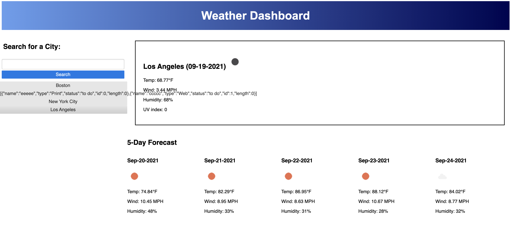

# Weather Dashboard 

The purpose of this dashboard is to allow the user to search for a specific city and recieve the current weather, as well as the 5-day forecast. Local storage will save all sarched cities so the user can retrieve weather data with one click. The OpenWeather API returned coordinates only, so this had to be translated to the city name and displayed on the screen using JavaScript. You will notice that the screen is displaying a string of content in the cities list - this is an unknown error that I wasn't able to figure out. 

Deployed URL: https://emackenziesmith.github.io/weather-dashboard/ 
Distributor Info: 
    GitHub: emackenziesmith
    Email: emackenziesmith@gmail.com

